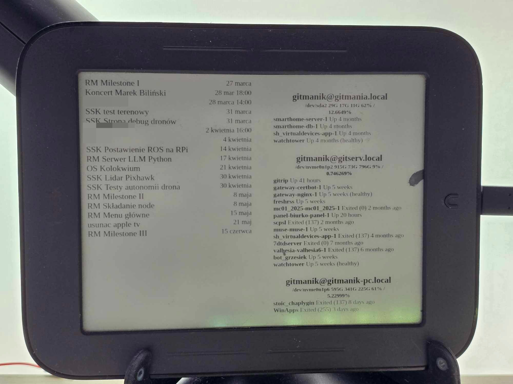

# SimpleCommandPanel

The SimpleCommandPanel is a minimalist control panel allowing user to track current Todoist tasks and check on Docker containers health on multiple servers at once.

## Usage


I personally use this project with my old repurposed Nook Simple Touch with Android 2.1 i found years ago.
An endpoint `/render` is available which uses Html2Image library to render image using built-in chromium for older devices which don't support new CSS. 

## Installation

### docker-compose.yml

Example docker compose file exposing SimpleCommandPanel on port 1337 with `./keys` folder and `config.json` redirected to container.

```
services:
  command-panel:
    image: ghcr.io/gitmanik/simplecommandpanel:main
    ports:
      - "1337:5000"
    volumes:
      - /var/run/dbus:/var/run/dbus
      - /var/run/avahi-daemon/socket:/var/run/avahi-daemon/socket
      - ./config.json:/python-docker/config.json
      - ./keys:/python-docker/keys
```

### config.json 
```json
{
    "todoist_api_key": "<Your Todoist API Key>",
    "todoist_project_name": "<Todoist Project to show>",
    "refresh_timer": 300,
    "data_update_timer": 120,
    "servers": [
        ["<IP or domain name>", "<username>", "<password or null if using key>", "<relative path to SSH key or null if using password>"],
        ["gitserv.local", "gitmanik", null, "my_key.ppk"],
        ["gitmanik-pc.local", "gitmanik", "my_password", null]
    ]
}

```

## Used libraries
  * Flask
  * Html2Image
  * Todoist API
  * paramiko
